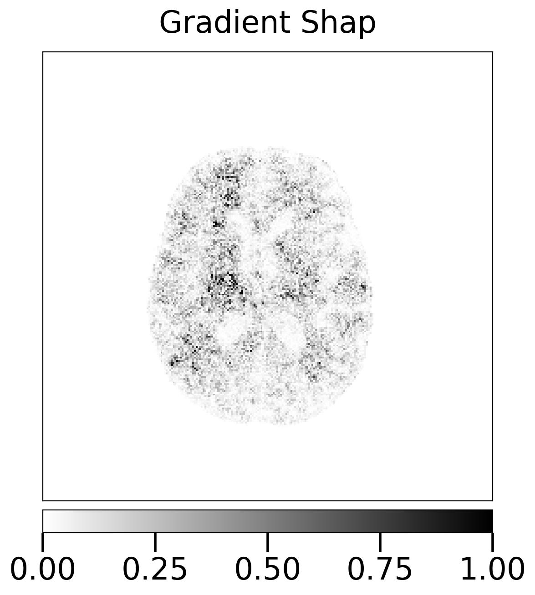
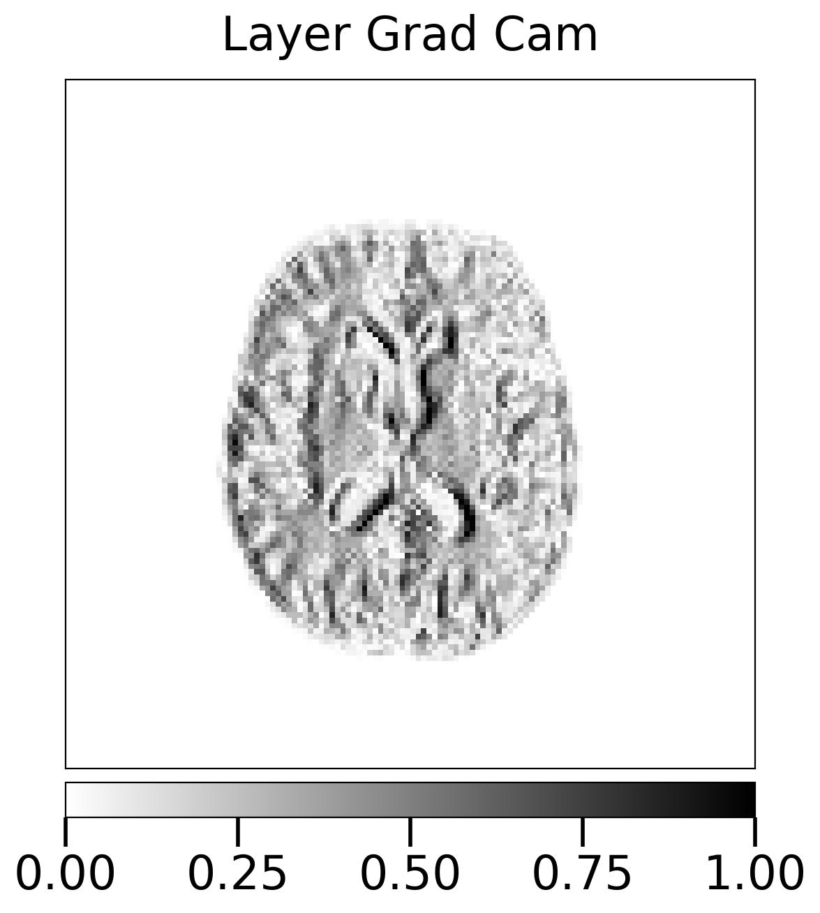
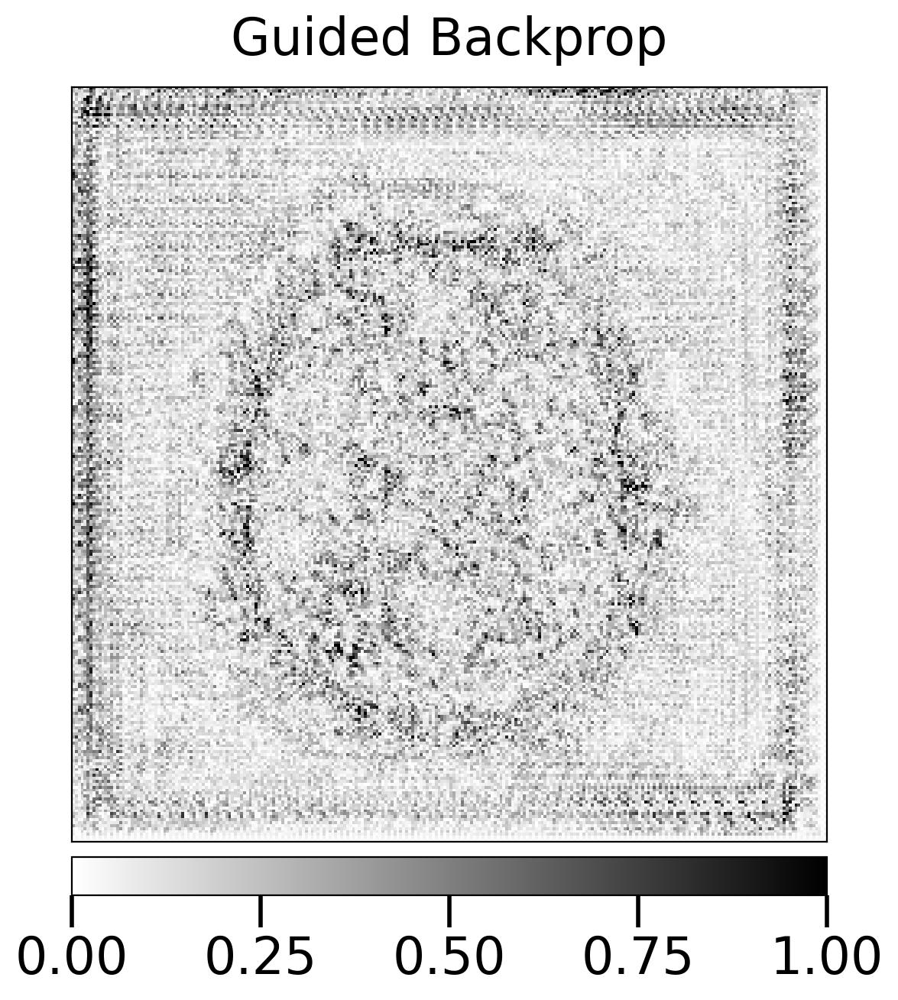
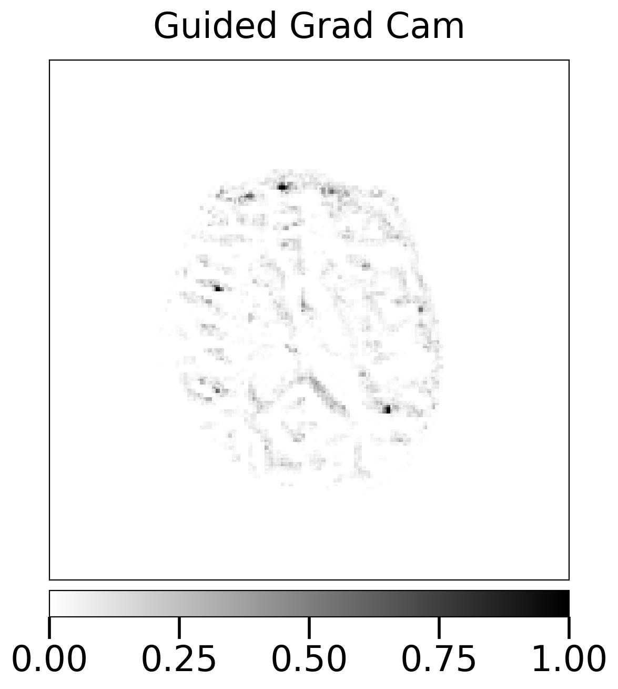
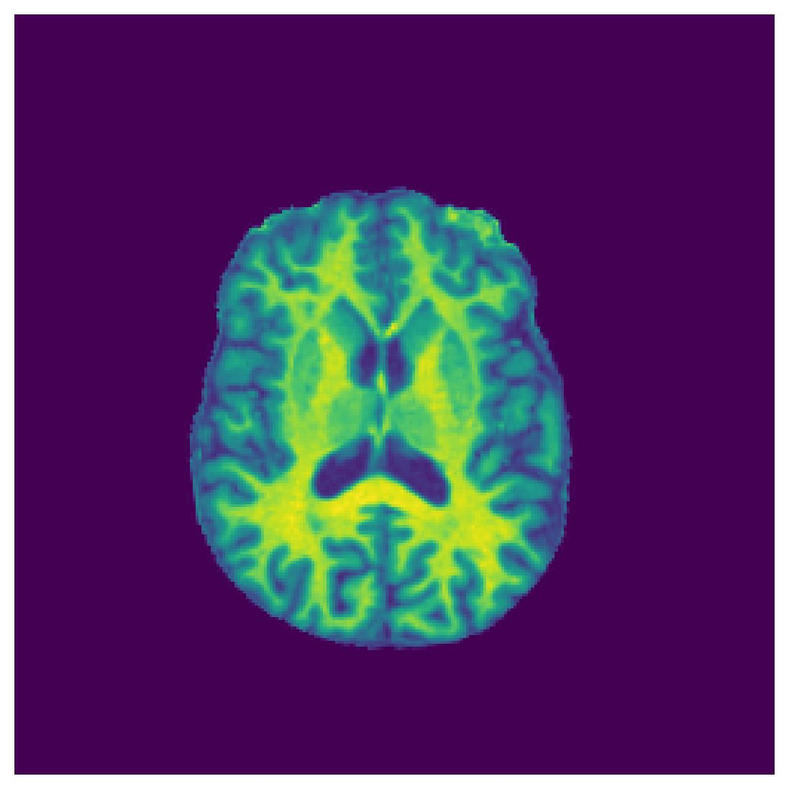
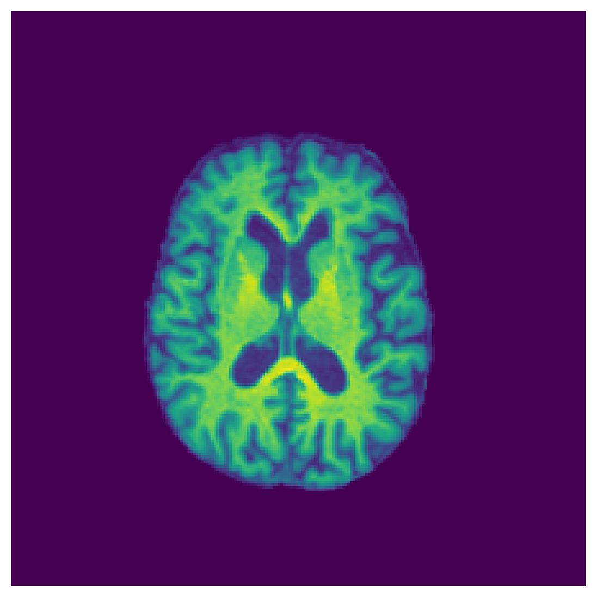
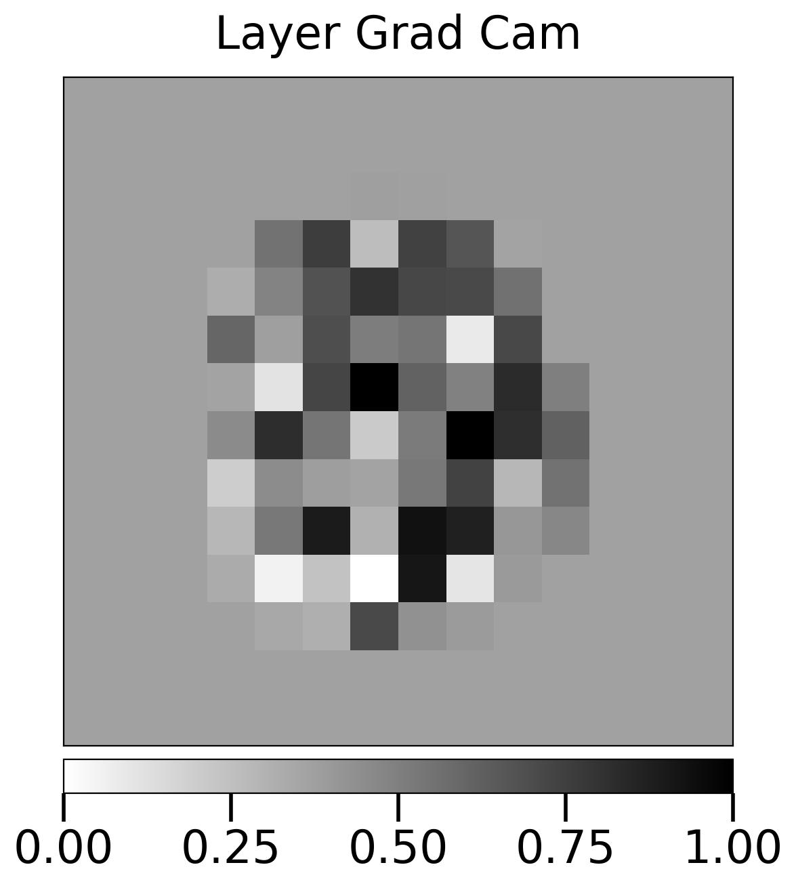
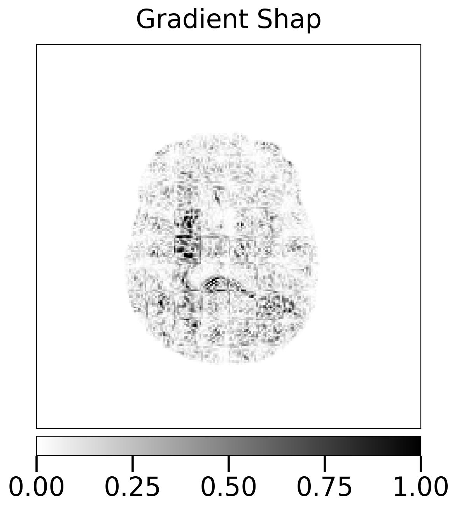

Table of contents
- [TemporalGradCam](#temporalgradcam)
  - [Dataset](#dataset)
  - [Model](#model)
  - [Temporal Model](#temporal-model)
  - [Results](#results)
  - [Interpretation](#interpretation)
    - [Interpreting sample patient image for **ResNet**](#interpreting-sample-patient-image-for-resnet)
    - [Interpreting sample patient image for **ViT**](#interpreting-sample-patient-image-for-vit)
  - [Tools](#tools)
  - [Files](#files)
  - [Literature](#literature)

# TemporalGradCam
Temporal interpretation of medical image data.

## Dataset 

The `OASIS_2D` dataset contains brain X-ray images of 100 patients.
- 50 images with disease (`label 1`), 43 unique patients
- 50 images with healthy (`label 0`), 10 unique patients
- The image size is 256 x 256 colored. 
- For experiement we split the dataset 80:20 for train and test using unique patients. So the same patient will not appear in both training and test. The split is stratified, so balanced amount of healthy and disease examples is present in train and test.
- No data augmentation is used at this point.

*Figure*: Length distribution when patients images are converted to a time series. Each patient can have multiple X-rays at different days. Most patients only have one image.

## Model

Currently we have the following two models implemented
- [ResNet18](https://pytorch.org/vision/stable/models/generated/torchvision.models.resnet18.html#torchvision.models.resnet18)
- [ViT](https://pytorch.org/vision/main/models/generated/torchvision.models.vit_b_16.html#torchvision.models.vit_b_16) (vit_b_16)

For training we `freeze all layers except the output Linear layer`. 
- Epochs: 25
- Learning rate: 1e-3
- Early stop: 5
- Experiment iteration: 5, the whole experiment is repeated 5 times using different random seed each time. The test results and best model checkpoints are saved.

*Figure*: Training vistory of one iteration from ResNet

## Temporal Model

To create the temporal version of the OASIS model we, 
- Extracted features from the images using the pretrained models (ResNet or ViT). The extracted feature dimension is equal to the dimension of layer just before the output layer.
  - 512 for ResNet
  - 768 for ViT
- For each sample
  - find previous images of the same patient, max upto seq length 
  - create the time series example [seq_len, feature_dim]. 
  - smaller sequences are padded at the beginning to the max sequence length. Larger sequences are truncated from the beginning (olders images are dropped).
  - we currently use `seq_len 3`, around 70% examples fall within this range. Rest are padded.
- The model is batch first. Pytorch doesn't easily support variable length time sequences. 
- Currently we use a simple `DNN` model on the the temporal dataset.
  - max epochs 100
  - learning rate 1e-3
  - dropout=0.1
  - hidden_size=64

## Results 

Following shows the average test result across all five iterations. 

| Model | Loss | Accuracy | F1-score | AUC |
|:---|:---:|:---:|:---:|:---:|
| ResNet | 1.32 | 83.87 | 81.32 | 91.68 | 
| ResNet (Seq 3) | 1.45 | 79.87 | 81.24 | 82.24 |
| ViT | 1.22 | 85.77 | 86.50 | 92.08 |
| ViT (Seq 3) | 0.94 | 87.72 | 88.25 | 95.13 |

The temporal model (sequence length 3) with Vision Transformer is performing best so far.

## Interpretation

### Interpreting sample patient image for **ResNet**
Note that, this is not for the temporal model.

| No | Sample | Gradient Shap | GradCam | Guided GradCam | Guided Backprop |
|:---:|:---:|:---:|:---:|:---:|:---:|
| 1|  |  |  |  |  |
| 2|  |  |  |  |  |
| 3|  |  |  |  |  |

### Interpreting sample patient image for **ViT**
Note that, this is not for the temporal model.

| No | Sample | Gradient Shap | GradCam | Guided GradCam | Guided Backprop |
|:---:|:---:|:---:|:---:|:---:|:---:|
| 1 |  |  |  |  |  |
| 2 |  |  |  |  |  |
| 3 |  |  |  |  |  |

<!--  -->

## Tools 
* [Captum](https://captum.ai/)
* [GuidedGradCAM](https://github.com/fitushar/3D-GuidedGradCAM-for-Medical-Imaging)

## Files

The following files are available for now with pre-trained vision models for transfer learning on the medical dataset.

* oasis_resnet: Run the oasis dataset with ResNet model.
* oasis_ViT: Run the oasis dataset with Vision Transformer.

## Literature

* [GRAD-CAM GUIDED CHANNEL-SPATIAL ATTENTION MODULE FOR FINE-GRAINED VISUAL CLASSIFICATION](https://ieeexplore.ieee.org/iel7/9596063/9596068/09596481.pdf)
* [MGAug: Multimodal Geometric Augmentation in Latent Spaces of Image Deformations](https://arxiv.org/pdf/2312.13440.pdf)
* [Grad-CAM: Visual Explanations from Deep Networks via Gradient-based Localization](https://arxiv.org/pdf/1610.02391.pdf)